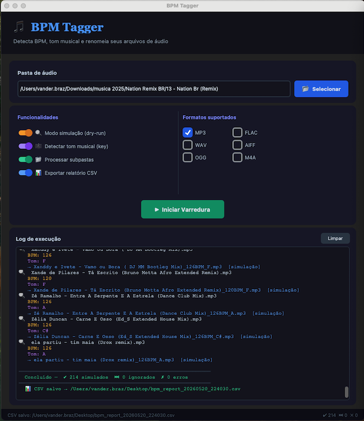
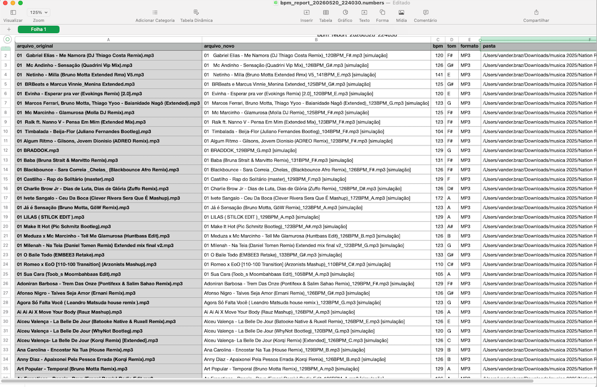

# 🎵 BPM Tagger

[](https://github.com/vanderbrazglobo/bpm-tagger/actions/workflows/ci.yml)
[](LICENSE)
[](https://www.python.org/downloads/release/python-31110/)
[]()


> Detecta BPM e tom musical de arquivos de áudio e renomeia automaticamente.

Disponível em dois modos: **app desktop com interface gráfica** e **script de terminal**.

---

## 📸 Screenshots

### App principal


### Relatório CSV gerado


---

## 📦 Download

| Plataforma | Arquivo | Tamanho |
|---|---|---|
| macOS (instalador) | [⬇️ BPM-Tagger-1.7.0.dmg](https://github.com/vanderbrazglobo/bpm-tagger/releases/download/v1.7.1/BPM-Tagger-1.7.0.dmg) | 115 KB |
| macOS / Linux (zip) | [⬇️ bpm-tagger-v1.7.1.zip](https://github.com/vanderbrazglobo/bpm-tagger/releases/download/v1.7.1/bpm-tagger-v1.7.1.zip) | 11 KB |

Ou acesse todas as versões: [Releases](https://github.com/vanderbrazglobo/bpm-tagger/releases)

---

## ✅ Requisitos

- Python 3.11 — instale em [python.org](https://www.python.org/downloads/release/python-31110/) (não use o Homebrew no macOS)
- macOS (qualquer versão) ou Linux Ubuntu 20.04+

---

## 🚀 Instalação

### macOS

**Opção 1 — DMG (recomendado)**

1. Baixe o arquivo `BPM-Tagger-1.7.0.dmg`
2. Abra o arquivo
3. Arraste **BPM Tagger** para a pasta **Aplicativos**
4. Abra e aproveite

**Opção 2 — ZIP**

```bash
# 1. Crie o ambiente virtual com Python 3.11
/Library/Frameworks/Python.framework/Versions/3.11/bin/python3.11 -m venv ~/envs/bpm

# 2. Ative o ambiente
source ~/envs/bpm/bin/activate

# 3. Instale as dependências
pip install customtkinter mutagen soundfile cffi audioread
pip install --no-deps librosa
pip install audioread decorator joblib numpy packaging pooch \
            scikit-learn scipy soxr typing_extensions lazy_loader msgpack

# 4. Execute o app
~/envs/bpm/bin/python3.11 bpm_tagger_app.py
```

> 💡 Após a instalação, você também pode abrir o app com duplo clique no arquivo `BPM Tagger.command`.

### Linux Ubuntu

```bash
# 1. Instale as dependências do sistema
sudo apt update
sudo apt install -y build-essential python3.11 python3.11-tk \
                    python3.11-venv ffmpeg libsndfile1

# 2. Crie e ative o ambiente virtual
python3.11 -m venv ~/envs/bpm
source ~/envs/bpm/bin/activate

# 3. Instale as dependências Python
pip install customtkinter mutagen soundfile cffi audioread
pip install --no-deps librosa
pip install audioread decorator joblib numpy packaging pooch \
            scikit-learn scipy soxr typing_extensions lazy_loader msgpack

# 4. Execute o app
python bpm_tagger_app.py
```

---

## 🎧 Como usar

### App com interface gráfica

1. Clique em **Selecionar** para escolher a pasta com os arquivos de áudio
2. Configure as opções desejadas
3. Clique em **Iniciar Varredura**
4. Acompanhe o progresso no log em tempo real

### Script de terminal

```bash
# Simular sem renomear (recomendado antes de rodar de verdade)
~/envs/bpm/bin/python3.11 bpm_tagger.py /caminho/da/pasta --dry-run

# Renomear de verdade
~/envs/bpm/bin/python3.11 bpm_tagger.py /caminho/da/pasta

# Log detalhado
~/envs/bpm/bin/python3.11 bpm_tagger.py /caminho/da/pasta --debug
```

### Resultado nos arquivos

```
Antes:  musica.mp3
Depois: musica_128BPM.mp3

Com tom ativado:
Depois: musica_128BPM_Am.mp3
```

---

## ⚙️ Opções disponíveis

| Opção | O que faz |
|---|---|
| **Modo simulação (dry-run)** | Mostra o que seria renomeado sem alterar nenhum arquivo. Sempre use antes de rodar de verdade. |
| **Detectar tom musical (key)** | Identifica a tonalidade da música (ex: Am, C, F#) e adiciona ao nome. |
| **Processar subpastas** | Varre todas as pastas recursivamente. |
| **Exportar relatório CSV** | Salva um relatório com BPM, tom e formato de cada arquivo. |
| **Formatos (MP3, FLAC, WAV...)** | Selecione quais tipos de arquivo serão processados. |

---

## ✨ Funcionalidades

- 🎵 Detecção automática de BPM
- 🎼 Identificação de tom musical (key)
- 📁 Processamento de subpastas
- 📊 Exportação de relatório CSV
- 🎧 Suporte a MP3, FLAC, WAV, AIFF, OGG, M4A
- 🔍 Modo simulação (dry-run)
- 🛡️ Preservação de metadados ID3
- 🔁 Proteção automática contra duplicação — arquivos já processados são ignorados

---


## ⚠️ Aviso de segurança macOS (Gatekeeper)

Ao abrir o app pela primeira vez, o macOS pode exibir:
> *"A Apple não pôde verificar se o item BPM Tagger está livre de algum malware..."*

Isso acontece porque o app não está assinado com certificado Apple Developer.
Para abrir mesmo assim:

1. **Clique com botão direito** no BPM Tagger.app
2. Clique em **"Abrir"**
3. Na janela que aparecer, clique em **"Abrir"**

Ou via terminal:
```bash
xattr -d com.apple.quarantine "/Applications/BPM Tagger.app"
```

---

## 🤝 Contribuindo

Consulte o guia completo em [CONTRIBUTING.md](CONTRIBUTING.md).

---

## 🔗 Links

- [Releases](https://github.com/vanderbrazglobo/bpm-tagger/releases)
- [Reportar problema ou sugestão](https://github.com/vanderbrazglobo/bpm-tagger/issues)
